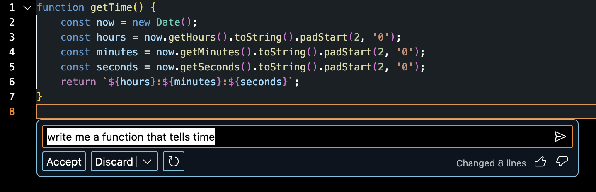
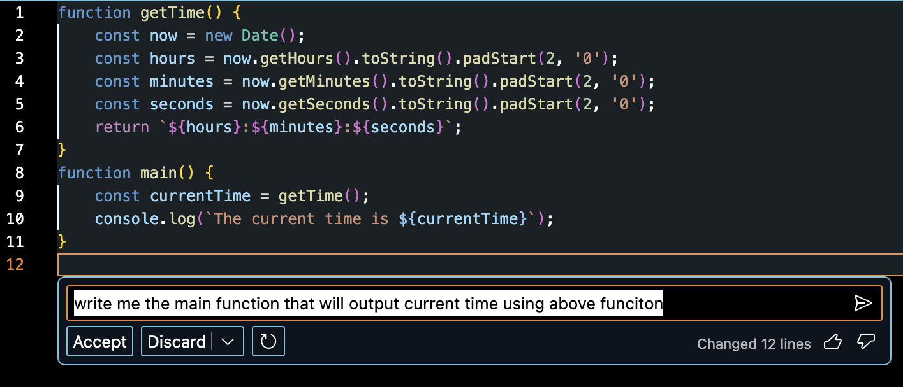
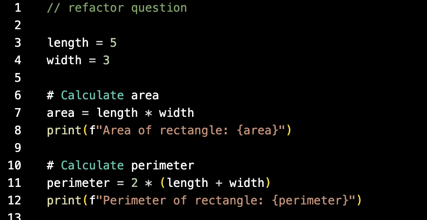
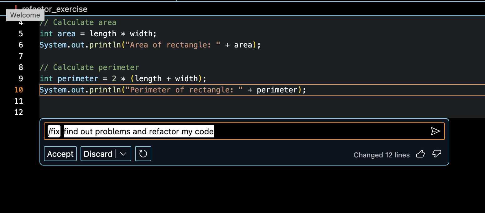
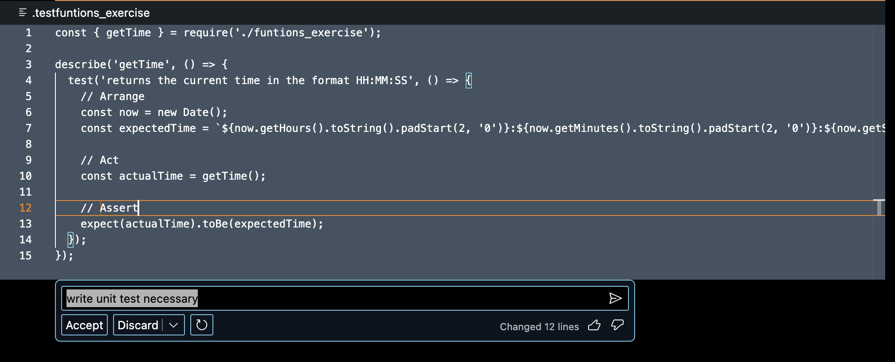

# CMPE297-Chatgpt_Interpreter_Assignment

# Assignment #1

Asking Chat GPT4 to write a simple Deep Learning Project

[Medium article](https://medium.com/@abraham.jkong/deep-diving-into-handwritten-digit-recognition-with-chatgpt-d7c324a20f46)

[GPT prompt link](https://chat.openai.com/share/66d57611-e497-41d7-ab47-1cf5e3c3243d)

# Assignment #2

## Showcasing writing functions

## Showcasing Code Refactoring

Ask GPT to write an example for me to do Code Refactor

## Showcasing writing unit trst

## Showcasing writing the entire app
